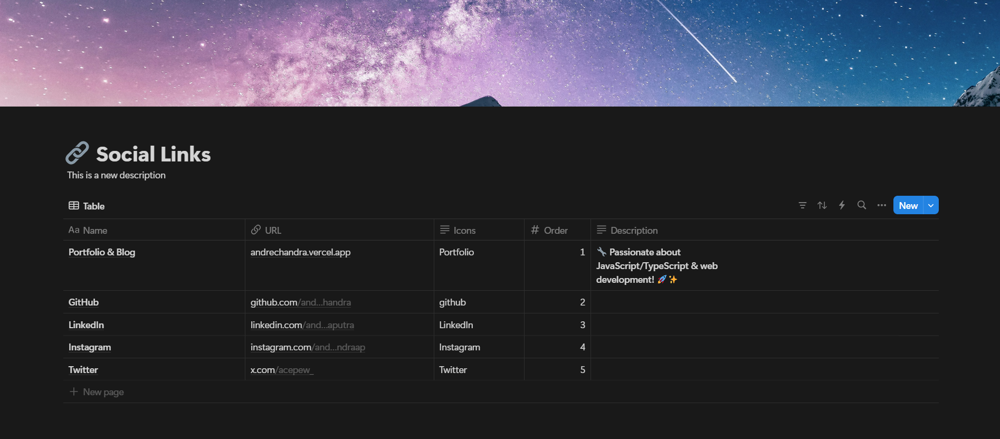

# 🚀 Notion Links

A **personalized Linktree-style website** built with **Next.js**, using the **Notion API** as a CMS for seamless link management.

## ✨ Features

- 🔗 **Dynamic Link Management** - Manage links effortlessly via Notion
- 🎨 **Responsive UI** - Optimized layout for mobile and desktop
- 📢 **Social Media Icons** - Easily link to social profiles
- 📤 **Share Button** - Quickly share the website URL

## 🛠️ Tech Stack

- **Next.js** - Frontend framework
- **Notion API** - Link management
- **Tailwind CSS** - Styling
- **ShadCN UI** - UI Components

---

## 📦 Installation

1. **Clone the repository**
   ```bash
   git clone https://github.com/andrechandra/notion-links.git
   cd notion-linktree
   ```
2. **Install dependencies**
   ```bash
   pnpm install
   ```
3. **Set up environment variables**  
   Create a `.env.local` file and add:
   ```env
   NOTION_TOKEN=your-notion-integration-secret
   NOTION_DATABASE_ID=your-notion-database-id
   ```
4. **Run the development server**
   ```bash
   pnpm dev
   ```
5. **Open in browser:** [`http://localhost:3000`](http://localhost:3000)

---

## 📌 Step-by-Step Guide

### 🔗 Setting Up Notion API

1. **Create a Notion integration**

   - Go to [Notion Integrations](https://www.notion.so/my-integrations)
   - Click **"Create Integration"**
   - Copy the generated **API Token**

2. **Get the Notion Database ID**

   - Open your Notion database
   - Copy the **database ID** from the URL (it’s the long string after `notion.so/your-workspace/`)

3. **Connect Database to Integration**
   - Open the Notion database
   - Click **"Share"** → **Invite** your integration
   - Give it **full access**

---

### 📋 Create These Columns in Your Notion Database

| Column Name     | Type   | Purpose               |
| --------------- | ------ | --------------------- |
| **Name**        | Text   | Title of the link     |
| **URL**         | URL    | Destination URL       |
| **Order**       | Number | Determines link order |
| **Description** | Text   | Short description     |

---

## 🖼️ Screenshots

### **Notion Database Setup**



### **Website Preview**


---

## 💡 Future Improvements

- 📝 **Customizable Themes**
- 🎨 **More Styling Options**
- 📊 **Analytics for Link Clicks**

## 📜 License

This project is licensed under the MIT License.

---

### 🚀 Made with ❤️ by Andre Chandra Putra
